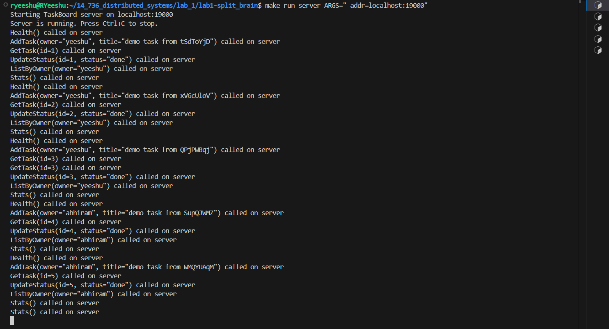
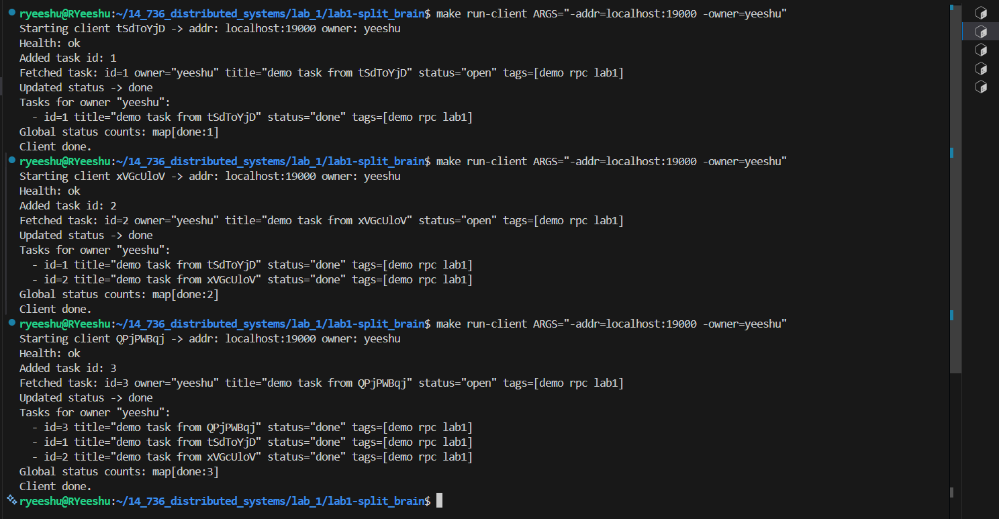
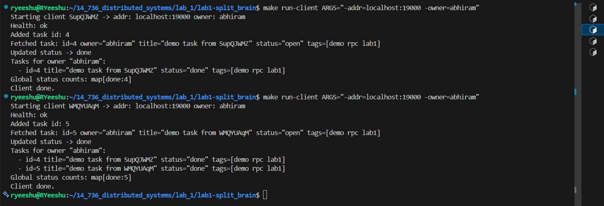
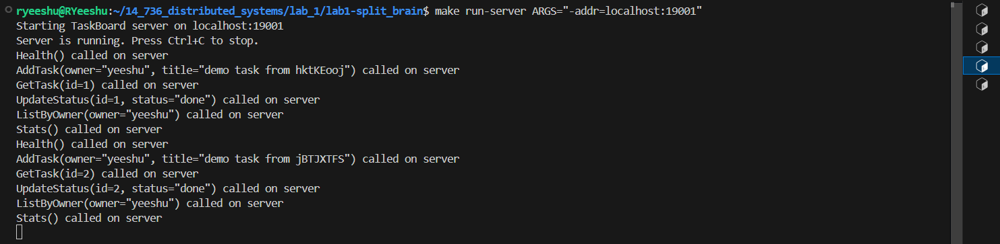
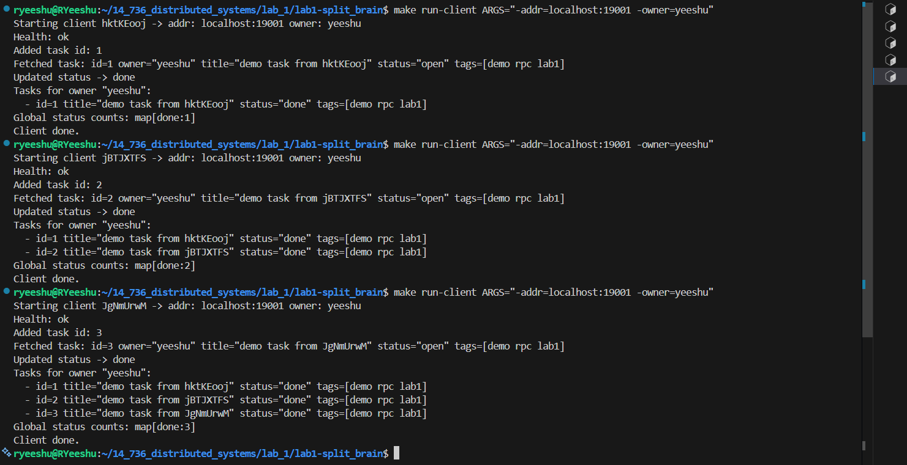

# Application User’s Guide (myapp)

### What the application does

Our example application is a small **TaskBoard** service (a shared task list) hosted on a server.  
Clients connect to the server using our `remote` library and interact with the TaskBoard using normal-looking method calls on a stub.

The service demonstrates:
- **Stateful behavior**: tasks are stored in memory on the server and persist across multiple client runs (until the server stops).
- **Multiple clients**: running the client multiple times updates and reads the same TaskBoard state (as long as they use the same server address).
- **Complex data types**: we send/receive a `Task` struct (includes `time.Time` and `[]string`), and also return maps like `map[int]Task` and `map[string]int`.

### Service interface (methods)

The shared service interface is `TaskService`, with these methods:
- `Health() -> (string, RemoteError)`  
  Quick check that server is reachable (“ok”).
- `AddTask(Task) -> (int, string, RemoteError)`  
  Adds a task, returns the generated task ID. Second return value is an **application error string** (empty if OK).
- `GetTask(int) -> (Task, string, RemoteError)`  
  Gets a task by ID, returns app error string if not found.
- `ListByOwner(string) -> (map[int]Task, RemoteError)`  
  Lists all tasks owned by a specific owner.
- `UpdateStatus(int, string) -> (string, RemoteError)`  
  Updates task status (for example, “open”, “done”). Returns app error string if invalid.
- `Stats() -> (map[string]int, RemoteError)`  
  Returns counts of tasks grouped by status.

### Design notes

- **Server**
  - Runs one TaskBoard instance per TCP address/port.
  - Uses a mutex to protect shared state (`tasks` map and `nextID`).
  - Logs method calls to the terminal so it is easy to see what is happening.
  - Runs until Ctrl+C, then stops cleanly.

- **Client**
  - Creates a CallerStub using `remote.CallerStubCreator`.
  - Runs a simple flow:
    1) Health check  
    2) Add one task  
    3) Get the same task back  
    4) Update its status  
    5) List tasks for the owner  
    6) Print global stats  
  - Supports an `-owner` flag so multiple client runs can share the same owner name and demonstrate shared state.

### Limitations

- **In-memory only**: tasks are not persisted; if the server stops, state is lost.
- **Type registration requirement**: because the library uses `any` in messages, we must `gob.Register(...)` all concrete types transferred inside `any` on both client and server (Task, maps, slices, etc.).
- **Basic CLI**: client behavior is a fixed demo sequence, not a full interactive shell.

---

### Build and Run Instructions

#### 1) Build
From the repository root:
```sh
make build
```

#### 2) Run server
In one terminal:
```sh
make run-server ARGS="-addr=localhost:19000"
```
Server prints that it started and waits until Ctrl+C.

#### 3) Run client
In another terminal:
```sh
make run-client ARGS="-addr=localhost:19000 -owner=yeeshu"
```
You can run the client multiple times (even concurrently in multiple terminals).  
```sh
make run-client ARGS="-addr=localhost:19000 -owner=abhiram"
```
All clients that use the same address talk to the same TaskBoard instance.

#### 4) Demonstrate multiple instances on different ports
Run a second server on another port:
```sh
make run-server ARGS="-addr=localhost:19001"
```
Then run a client against it:
```sh
make run-client ARGS="-addr=localhost:19001 -owner=yeeshu"
```
This will interact with a different TaskBoard state (because it is a different instance on a different port).


### Application Screenshots

The following screenshots show the TaskBoard server and client runs.

#### Server 1



#### Server 1 Client Run 1



#### Server 1 Client Run 2



#### Server 2



#### Server 2 with Client Run


